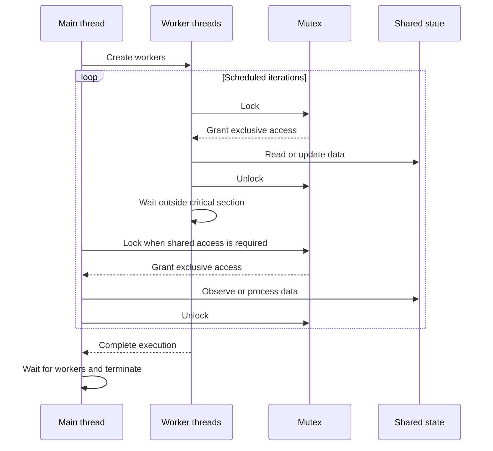

# Mutex-Based Thread Synchronization in C

Mutex-Based Thread Synchronization in C is a collection of six standalone exercises that explore concurrent programming through coordinated access to shared state. The project covers bounded updates, competition between workers, conditional calculations, randomized data generation, timed execution, orderly termination, and a compact sensor monitoring simulation. Each program presents a distinct synchronization scenario and demonstrates how concurrent activities can cooperate while preserving consistent access to shared resources.

## Project Overview

The repository focuses on the practical foundations of thread synchronization in C. Every exercise is an independent console application, so it can be compiled and executed separately from the others.

| Exercise | Scenario | Core behavior |
| --- | --- | --- |
| `exercise_01.c` | Bounded counter | Two workers increase a shared value and two decrease it while enforcing upper and lower conditions. |
| `exercise_02.c` | Update competition | Three workers compete to modify shared state and report how many successful changes they performed. |
| `exercise_03.c` | Coordinated subtraction | Three workers produce independent values while the main thread conditionally calculates a result and resets the shared state. |
| `exercise_04.c` | Coordinated addition | Two workers generate values at different intervals while the main thread conditionally computes their sum. |
| `exercise_05.c` | Concurrent transformations | Increment and multiplication workers transform a shared value until the main thread completes its observation cycle. |
| `exercise_06.c` | Sensor monitoring | Three workers simulate temperature, humidity, and energy sensors while the main thread periodically displays their readings. |

Across the collection, mutex protected critical sections serialize access to shared data. Delays are kept outside those sections so other threads can continue working while one thread is paused. The exact order of messages and generated values can vary between runs because thread scheduling and random data are nondeterministic.

## Synchronization Model

The programs follow this general execution model, with small variations according to each exercise:



## Requirements

To build and run the programs, the system must provide:

- A C compiler with C11 support, such as GCC or Clang
- A POSIX compatible environment
- The POSIX Threads library
- A terminal or command line shell

The programs require no command line arguments, configuration files, or interactive input.

## Setup

### Windows

Use Windows Subsystem for Linux to provide the POSIX interfaces required by the source files.

1. Open PowerShell as Administrator and install WSL with an Ubuntu distribution:

   ```powershell
   wsl --install -d Ubuntu
   ```

2. Restart Windows if requested, launch Ubuntu, and install the compiler toolchain:

   ```bash
   sudo apt update
   sudo apt install build-essential
   ```

3. In the Ubuntu shell, navigate to the repository. Windows drives are available below `/mnt`; for example, a repository stored on drive `C:` can be reached below `/mnt/c`.

### macOS

Open Terminal and install the Apple command line developer tools:

```bash
xcode-select --install
```

### Linux

Install a C toolchain using the package manager for the distribution.

Debian and Ubuntu:

```bash
sudo apt update
sudo apt install build-essential
```

Fedora:

```bash
sudo dnf group install "Development Tools"
```

Arch Linux:

```bash
sudo pacman -S base-devel
```

## Build

Run the following commands from the repository root in a POSIX shell. Each source file is compiled into a separate executable under the `build` directory.

```bash
mkdir -p build

cc -std=c11 -pthread exercise_01.c -o build/exercise_01
cc -std=c11 -pthread exercise_02.c -o build/exercise_02
cc -std=c11 -pthread exercise_03.c -o build/exercise_03
cc -std=c11 -pthread exercise_04.c -o build/exercise_04
cc -std=c11 -pthread exercise_05.c -o build/exercise_05
cc -std=c11 -pthread exercise_06.c -o build/exercise_06
```

To compile only one exercise, run the corresponding command from the list above.

## Run

Execute any program from the repository root:

```bash
./build/exercise_01
./build/exercise_02
./build/exercise_03
./build/exercise_04
./build/exercise_05
./build/exercise_06
```

Run one executable at a time and allow it to complete before starting the next one. Each exercise prints its concurrent activity directly to the terminal and terminates according to its own iteration or timing conditions.

## Concepts Demonstrated

- Creation and coordination of multiple POSIX threads
- Mutual exclusion around shared mutable state
- Definition and protection of critical sections
- Conditional updates performed by concurrent workers
- Main thread observation and aggregation
- Timed worker activity outside protected regions
- Thread completion and resource cleanup
- Nondeterministic scheduling and generated data
